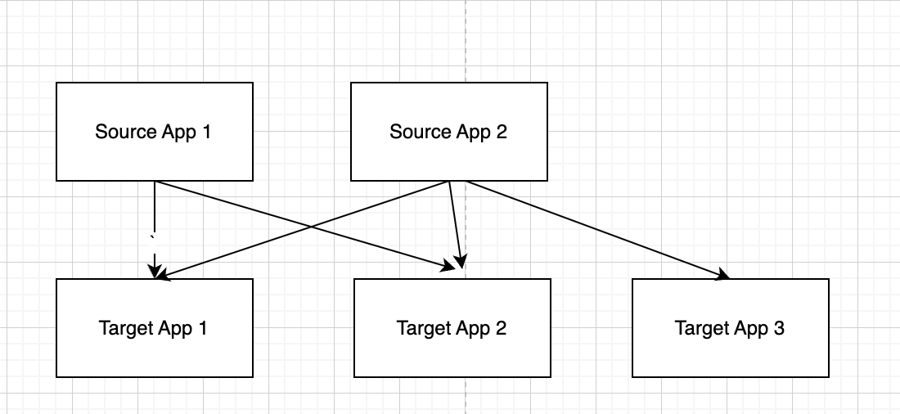

아파치 카프카를 왜 사용하는지에 대해 알려면 탄생 배경과 구조를 아는것이 좋아보인다.
따라서 탄생 배경과 구조를 정리하고 카프카를 왜 사용해야하는지 생각해보자.  

## 카프카의 탄생 배경
카프카는 링크드인에서 개발했다.  
링크드인에서는 데이터 수집과 적재 아키텍처를 운영하는데 큰 어려움을 겪었다.  
데이터를 생성하고 적재하기 위해서는 데이터를 생성하는 소스 애플리케이션에서 데이터를 적재하는 타겟 애플리케이션으로의 연결이 필요한데  
링크드인 서비스 규모가 커지면서 관리가 힘들어졌고 타겟 애플리케이션의 장애는 물려있는 소스 애플리케이션의 장애로 이어졌다.  

링크드인은 이를 해결해보려고 상용 데이터 프레임워크와 오픈소스를 기존 아키텍처에 녹여내어 데이터 파이프라인의 파편화를 개선하려고 시도했지만 아키텍처의 복잡도를 낮춰주지는 못했다.  
이와같은 문제 덕에 링크드인은 신규 시스템을 개발하기로 결정했고 그 프로젝트가 현재의 **아파치 카프카** 이다.  

## 카프카의 구조
카프카는 각 애플리케이션(소스 애플리케이션, 타겟 애플리케이션)의 중앙에서 데이터를 수집하고 소비할 수 있도록 설계되었다.  
이와같은 구조 덕에 서비스에서 발생하는 모든 데이터를 **한 곳**에서 실시간으로 관리할 수 있게 되었다.  
예를들어 웹에서 발생하는 로그, 앱 에서 발생하는 로그를 카프카에 넣으면 필요한곳에서 즉시 꺼내서 사용할 수 있게 된다.  

## 카프카 특징
어떻게 카프카는 많은 양의 데이터를 안전하고 빠르게 처리할 수 있는 것일까?  

### 높은 처리량 - 빠른 처리
카프카는 데이터 전송, 수신 시 데이터를 묶어서 전송한다. 이는 동일한 양의 데이터를 보낼 때 네트워크 통신 횟수를 줄인다.  
파티션 단위를 통해 동일 목적의 데이터를 여러 파티션에 분배하고 데이터를 병렬 처리할 수 있게 된다.

### 확장성 - 안전하게 확장
갑자기 많은 데이터가 들어오면 카프카는 브로커 개수를 늘려 스케일아웃할 수 있다.  
반대로 들어오는 데이터량이 적다면 브로커 개수를 줄일 수 도 있다.
### 영속성
카프카는 들어온 데이터를 메모리에 저장하는게 아닌 디스크에 저장한다.  
보통 파일 I/O를 사용하는것은 느리지만 카프카는 OS레벨에서 파일시스템을 최대한 활용하는 방법을 적용했다.  
운영체제에서는 파일 I/O 성능 향상을 위해 페이지 캐시 영역을 메모리에 따로 생성하여 사용함. 페이지 캐시 메모리 영역을 사용하여 한번 읽은 파일 내용은 메모리에 저장시켰다가 다시 사용하는 방식이기 때문에 카프카가 파일 I/O를 이용하더라도 처리량이 높은 것이다.  
이와같은 특성때문에 카프카 브로커가 종료되더라도 프로세스를 재시작하면 데이터를 다시 처리할 수 있게 된다.
### 고가용성
3개 이상의 브로커로 운영되는 카프카 클러스터는 일부 브로커에 장애가 발생하더라도 무중단으로 안전하고 지속적으로 데이터를 처리할 수 있는데  
카프카는 데이터 복제를 통해 고가용성의 특징을 가진다  
프로듀서로부터 전송받은 데이터를 1개의 브로커에만 저장하는게 아닌 다른 브로커에도 저장한다.  
이와같은 특성덕에 1개의 브로커에서 장애가 발생하더라도 나머지 브로커에 이미 데이터가 복제되어 있으니 지속적으로 데이터를 처리할 수 있게 된다.  

